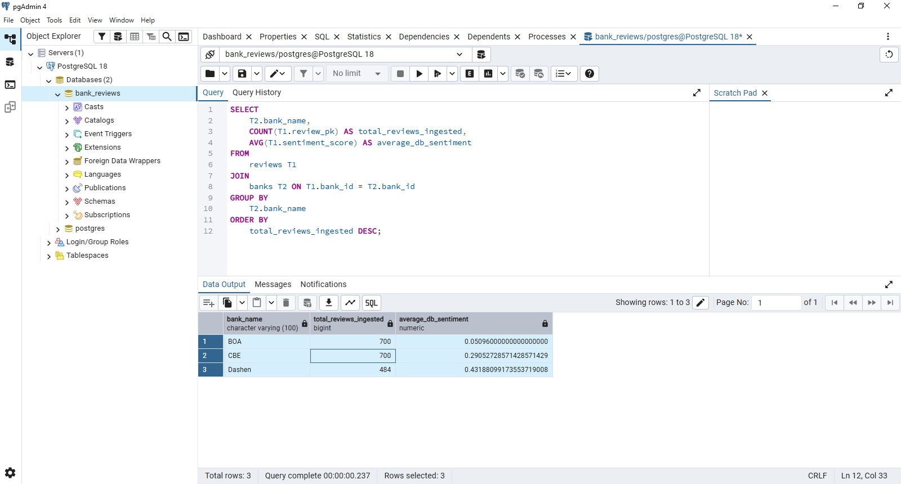
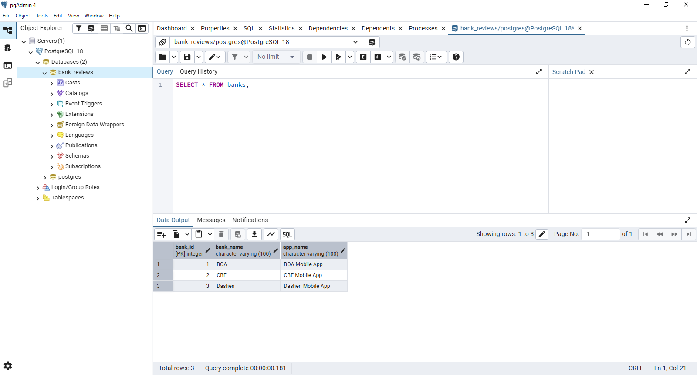

# 📂 **Task 3: PostgreSQL Database Setup and Data Ingestion**

This task focuses on creating a reliable PostgreSQL database and importing the enriched review dataset from the analysis stage. The goal is to ensure **persistent**, **query-optimized**, and **relationally structured** storage for all mobile banking review data.

---

# **1. Relational Schema Design (Normalized)**

The database follows a **normalized relational schema** with **two tables**:

* **banks** → Parent (stores bank information)
* **reviews** → Child (stores all reviews per bank)

The relationship is **One-to-Many**:
➡️ One bank can have many reviews.

---

## **1.1. `banks` Table (Parent)**

Stores the unique bank/application information.

| Column Name   | Data Type    | Constraints      | Description                               |
| ------------- | ------------ | ---------------- | ----------------------------------------- |
| **bank_id**   | SERIAL       | PRIMARY KEY      | Unique ID for each bank.                  |
| **bank_name** | VARCHAR(100) | UNIQUE, NOT NULL | Name of the bank (e.g., "Dashen", "CBE"). |
| **app_name**  | VARCHAR(100) | –                | Name of the mobile application.           |

---

## **1.2. `reviews` Table (Child)**

Stores every review and links each one to a bank.

| Column Name             | Data Type    | Constraints                 | Description                           |
| ----------------------- | ------------ | --------------------------- | ------------------------------------- |
| **review_pk**           | SERIAL       | PRIMARY KEY                 | Unique record ID.                     |
| **bank_id**             | INTEGER      | FOREIGN KEY → banks.bank_id | Links review to its bank.             |
| **review_id_generated** | INTEGER      | UNIQUE, NOT NULL            | Original index/ID from the CSV.       |
| **review_text**         | TEXT         | –                           | Raw customer review text.             |
| **rating**              | INTEGER      | NOT NULL                    | Star rating (1–5).                    |
| **review_date**         | DATE         | –                           | Date the review was posted.           |
| **sentiment_label**     | VARCHAR(10)  | –                           | “Positive”, “Neutral”, or “Negative”. |
| **sentiment_score**     | NUMERIC(5,4) | –                           | Sentiment polarity score.             |
| **identified_theme**    | VARCHAR(50)  | –                           | Thematic classification.              |
| **source**              | VARCHAR(50)  | –                           | Review source (e.g., "Google Play").  |

---

# **2. Setup and Prerequisites**

Before running the ingestion script, ensure the following:

---

### ✅ **2.1. PostgreSQL Server**

Make sure the PostgreSQL service is running.

---

### ✅ **2.2. Create the database**

Open pgAdmin or psql and run:

```sql
CREATE DATABASE bank_reviews;
```

---

### ✅ **2.3. Install required Python packages**

```bash
pip install psycopg2-binary pandas
```

---

### ✅ **2.4. Configure database credentials**

Update:

```
config/db_config.py
```

with your PostgreSQL username, password, host, and port.

---

# **3. Data Ingestion Process**

Run the ingestion script from the project root:

```bash
python src/database/task_3_database_storage.py
```

### The script performs the following actions:

1. Connects to the **bank_reviews** database.
2. Creates the **banks** and **reviews** tables (if not present).
3. Inserts unique bank names (e.g., Dashen, CBE, BOA) into `banks`.
4. Maps each review's `bank_name` to its corresponding `bank_id`.
5. Performs a **bulk insert** for all 1,884 processed reviews.

This ensures fast, safe, and consistent database population.

---

# **4. Verification Query (Confirm Data Integrity)**

Run this SQL in pgAdmin / psql to confirm correct data ingestion:

```sql
SELECT 
    T2.bank_name, 
    COUNT(T1.review_pk) AS total_reviews_ingested,
    AVG(T1.sentiment_score) AS average_db_sentiment 
FROM 
    public.reviews T1 
JOIN 
    public.banks T2 ON T1.bank_id = T2.bank_id 
GROUP BY 
    T2.bank_name 
ORDER BY 
    total_reviews_ingested DESC;
```

✔️ Confirms correct **join behavior**
✔️ Confirms the **number of reviews loaded** per bank
✔️ Confirms **average sentiment score**

---


# Banks Table


# REviews Table
